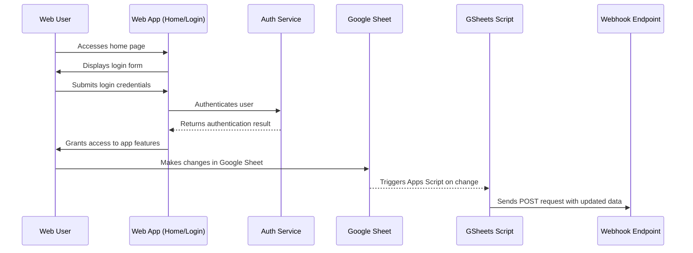

# Web API

This app provides a web interface with authentication, and integrates with a Google Sheet via a iframe. The flow begins when a user visits the home page and continues through login, interacting with the sheet, and processing the sheet updated with a Google Sheets script that sends the new information to a webhook endpoint.

- The login code can be found in the `app/api/auth/[...nextauth]/route.ts` and `components/LoginForm.tsx` files.
- The Google Sheet embed code can be found in the `components/GoogleSheetEmbed.tsx` file.
- The main app workings can be found in the `app/app.tsx` file.

